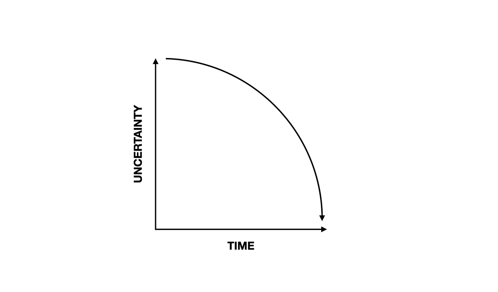
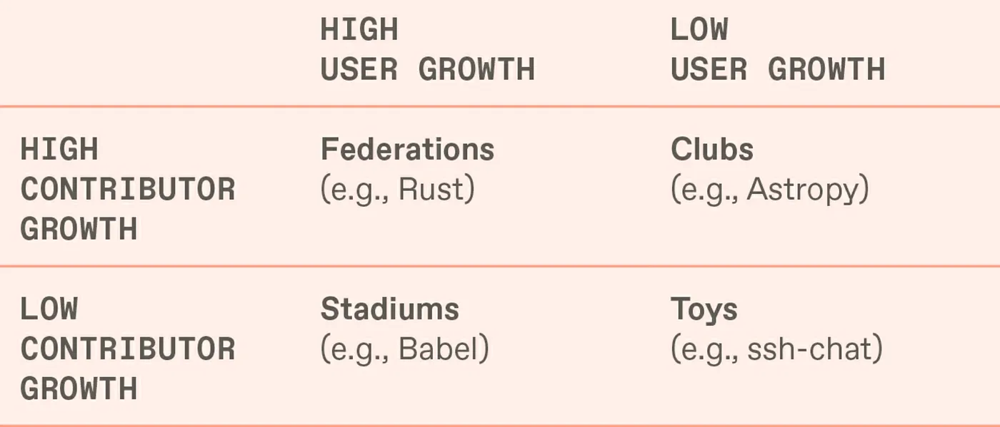

{
  "title": "A Call for More Programmable Retro-Funding for Digital Public Goods",
  "date": "06/26/2023"
}
---

> #### *This post originally appeared [here](https://mirror.xyz/cerv1.eth/I--a872b0kXAI6uFs4wLh_Sq9qAEbiRlA0YLPIqt2TQ) .*
>
# Introduction
Our lives are increasingly moving online, sparking new modes of interaction, communication, and creation. As we transition to a world where we occupy both physical and digital spaces, the concept of a "public good" must evolve accordingly.

Public goods already exist in the digital realm. Open source software is a prime example of a digital public good, underpinning everything from fundamental internet protocols like HTTP to the 'awesome' [list of lists](https://github.com/sindresorhus/awesome).

Yet, despite the significant societal value they generate, open source software projects frequently struggle with the existential challenge of acquiring stable funding.

Part of the problem is that we haven't found the right, digitally-native mechanisms for funding open source. Traditional approaches, from soliciting donations to applying for government grants, aren't a good fit for open source.

Consider Wikipedia, a household name in the realm of digital public goods. You've likely encountered the seemingly ever-present appeal banners asking for donations:

If a digital public good as prolific as Wikipedia remains strapped for cash, what can we assume about all the other, less visible open source initiatives?
***
It doesn't need to be this way. The big tech giants and internet-based businesses continuously vie for our attention, turning every click, like, and share into a monetizable event. This attention economy generates immense profits, a portion of which is paid as taxes to governments in the countries where these companies operate. These taxes are used for traditional public goods, infrastructure, education, healthcare, and more, but these businesses seldom directly fund the digital public goods that underpin their operations and profits.

What if the same type of rigorous analysis used to measure attribution was applied towards measuring impact? What if your favorite delivery app used the same type of programmability that allows you to order a pizza, tip the driver, and pay taxes in one transaction to fund the open source software they depend on?

# Programmable retro-funding
Programmable retro-funding offers a solution to the imbalance between the value created on the internet and the value that flows back to support digital public goods.

"Retro" is short for retrospective or retroactive, meaning projects are funded for work that's already happened, while "programmable" means there are pre-defined rules for distributing funds across individuals and teams.

Programmable retro-funding is a digitally-native form of grantmaking that's a much better fit for funding open source than existing approaches.

At least five elements are critical to effective retro-funding:

1. Proven Impact: Fund projects based on their established track record and demonstrated value, rather than speculative future promises.

2. Permissionless Monitoring: Make it so all stakeholders can see what's happening within a project, providing a transparent view of the project's progress and finances.

3. Fluid Entity Constructions: Embrace the often decentralized nature of open source, where the lines between contributor and user are blurry, and there is often no traditionally organized entity behind the project.

4. Plural Definitions of ROI: Encourage a multitude of ROI definitions and impact metrics in recognition of the fact that open source projects impact various participants and layers of the stack differently.

5. Programmable Funding Streams: Pre-define rules for distribution of funds across multiple projects and contributors, fostering a fair and incentivized ecosystem.

Now, I will dive into each of these ingredients in more depth, exploring their significance and the roles they play in programmable retro-funding.

# Proven Impact
> Fund projects based on their established track record and demonstrated value, rather than speculative future promises.

Forecasting the success and broad adoption of software projects often feels like a game of chance. Many factors, including market readiness, contributor reputation, technical robustness, and community adoption, are difficult to predict accurately.

Retro-funding is a viable alternative, enabling us to support projects that have already established their value and demonstrated significant impact.

Retro-funding operates on a simple principle: reward projects for the value they have already provided.

Unlike prospective funding models that bank on potential and predictions, retrospective funding relies on concrete evidence of success. This evidence can manifest in various forms, such as widespread usage, active community contributions, or notable advancements in the respective field.

This does not mean that projects shouldn't receive any prospective funding, just that more funding should be allocated retrospectively, when the reputation and impact of a project is already established.

Retro-funding also provides a powerful incentive for contributors to keep developing and maintaining their work. When we support creators on Substack or Patreon, we do so not because we want them to retire but because we want to motivate them to keep creating.

# Permissionless Monitoring
> Make it so all stakeholders can see what's happening within a project, providing a transparent view of the project's progress and finances.

Programmable retro-funding aligns nicely with the open source ethos of transparency and accountability.

Public repositories on platforms like GitHub provide an additional--albeit incomplete--picture of the work that's happening on a project. They offer a data-rich view of a project's development progress, showing the frequency and volume of code commits, contributor counts, and the nature of collaborations among contributors. Furthermore, issues and pull requests provide insight into community engagement, illustrating the vibrancy and responsiveness of a project's base of contributors and users.

Package dependency trackers reveal the degree to which other projects rely on a particular open source project, reflecting its importance within the broader software ecosystem. In crypto networks, smart contract events can signal how important a given protocol or implementation is to an ecosystem's overall activity.

All this is just scratching the surface. The open source nature of these projects presents the opportunity for innovative, crowdsourced metrics and attestations. Communities can define their own success metrics, aligning them closely with their own unique goals and data feeds.

Permissionless monitoring is also possible for finances. If a project uses an open treasury management tool, like those developed by [Open Collective](https://opencollective.com/) or [Safe](https://safe.global/), anyone who cares about the organization can see where funds are coming from and where they are going.

Combining work activity with financial activity enables permissionless monitoring.

Such transparency builds trust, reassures funders that their contributions are being used effectively, and demonstrates the project's financial sustainability to potential supporters.

**Fluid Entity Constructions**
> Embrace the often decentralized nature of open source, where the lines between contributor and user are blurry, and there is often no traditionally organized entity behind the project.

Many leading open source projects are decentralized in nature. They tap into a global pool of contributors and users. They don't have a traditional organizational structure or entity like an LLC or nonprofit.

The image below, proposed by Nadia (Eghbal) Asparouhova, contains a useful categorization of open source projects:

While each type of project has unique dynamics and needs when it comes to funding, "clubs" and "federations" are typically farthest out on the decentralization axis and therefore face a unique set of challenges when it comes to funding and incentivizing positive contributions.

Traditional funding models can conflict with the decentralized ethos of such projects. They usually necessitate the establishment of formal organizations to receive and distribute funds, which can add considerable administrative overhead. This overhead can divert resources away from the actual development work.

Moreover, the need for a formal organization can create barriers to entry for smaller projects or individual contributors that lack the capacity or desire to navigate this complexity.

The [Open Collective](https://opencollective.com/) was created in response to this problem, providing financial and legal infrastructure for thousands of open source projects. They serve as a fiscal host that takes care of accounting, taxes, banking, and non-profit status for open source teams.

Crypto funding is another alternative. Crypto makes it easy from day one to receive and distribute funding across geographic borders.

Retro-funders need to feel comfortable with the reality that the relationships among open source projects and their core contributors are often fluid, dynamic, and informal.

# Plural Definitions of ROI
> Encourage a multitude of ROI definitions and impact metrics in recognition of the fact that open source projects impact various participants and layers of the stack differently.

Quantifying impact at diverse scales and across varied ecosystems presents a significant challenge.

Trying to create an overarching impact metric, akin to "internet GDP," would be a formidable if not impossible task.

Moreover, any such universally applicable metric would still require support from a robust network of telemetry tools, data aggregators, and analysts.

As no single ROI metric may be able to capture the full impact of an open source project, it's more pragmatic to approach this as a collective intelligence problem. Make it so communities can easily compute their own ROI benchmarks.

For this to happen, we need [generalized impact evaluators](https://research.protocol.ai/publications/generalized-impact-evaluators/), broad and adaptable tools for measuring impact. These should rely on both observable impact outcomes and transparent financial data. The data sources and measurement instruments can be fine-tuned to the unique needs and characteristics of individual communities.

Open data sets pave the way for plural ROI measurements. Different stakeholders can leverage the same data to compute ROI from their unique perspectives.

Pluralistic measurement capabilities can provide crucial insights for retrospective funding decisions. They help correct for errors and ensure that funding allocations are based on demonstrable success and widely-observed impact.

# Programmable Funding Streams
> Pre-define the rules for distribution of funds across multiple projects and contributors, fostering a fair and incentivized ecosystem.

Programmability is essential to route funding across large groups of projects and within decentralized projects.

Programmability in this context means that rules can be pre-defined for how funds are split or otherwise distributed amongst a group of accounts.

Once a split is established, a funder can simply send money to single node and it will automatically be distributed pro-rata to other nodes according to a predetermined, auditable formula. The formula could leverage metrics such as contributions to a codebase or a set of parameters defined by the community. This introduces a simple, transparent way to reward contributors, and moreover, it automates what would otherwise be a complex and time-consuming process.

For example, the [Protocol Guild](https://twitter.com/optimismFND/status/1600187625649803265?ref_src=twsrc%5Etfw%7Ctwcamp%5Etweetembed%7Ctwterm%5E1600549804236341248%7Ctwgr%5E7edf490ee905efa8f5acd9fff94c57c5bcdb971f%7Ctwcon%5Es3_) has effectively used an Ethereum-based splits mechanism to distribute more than $10 million to over 100 developers working on Ethereum's core infrastructure. Here, the mechanism effectively recognizes and rewards the individual contributions of a diverse set of developers, fostering a culture of meritocracy.

Programmable funding mechanisms extend beyond the realm of individual projects. They enable easy and fair distribution of funds within or across projects through community voting mechanisms. Platforms such as [Gitcoin](https://www.gitcoin.co/) and [Optimism RPGF](https://app.optimism.io/retropgf) are two more leading examples from the Ethereum ecosystem. Gitcoin uses quadratic funding; Optimism uses retroactive public goods funding. Both rely on large communities of voters to allocate millions of dollars of funding to a range of open source projects. In doing so, they have reshaped the norms and expectations of open source contributors and how people think about contributing to the ecosystem.

Recurring streams of retrospective funding suddenly give every open source project a revenue model -- and transparent distribution rules give contributors confidence they will be rewarded fairly.

# Speedrunning Public Goods Funding
> Programmable retro-funding not only provides a dynamic solution to the enduring challenge of sustainable open source funding but also holds potential to transform the broader landscape of public goods financing.

Today, most grantmaking and sponsorship models used to fund open source mirror the requirements of traditional public goods and non-profit funding models. They have been designed to support registered organizations engaging in high upfront cost projects, often carried out by in-person teams. However, this mold doesn't fit the creators of digital public goods, who are usually decentralized, distributed, and face relatively low upfront costs. Here, programmable retrospective funding appears to be an ideal solution.

Furthermore, open source is a motley crew of projects and people. There's no single path from crowdfunding to corporate sponsorship, nor a universal metric for impact. programmable retrospective funding offers the flexibility to adapt to the distinct needs of various project types.

To fund digital public goods more effectively, we need to speedrun the lessons learned over the last half century of grantmaking and develop powerful digitally-native mechanisms for raising, distributing, and measuring the impact of funds.

That's why we need to embrace programmable retrospective funding and open the taps to fund our public goods.